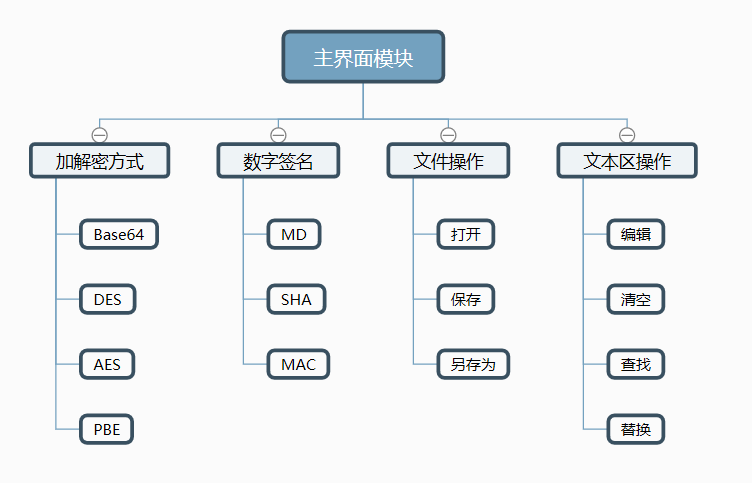
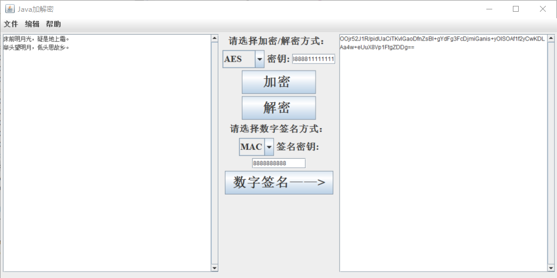

# SecurityMM
## ―――― Java加解密软件
暂时支持Base64编码；DES、AES、PBE加解密；MD、SHA、MAC数字签名。    后续会继续完善。  
(注：使用时，DES密钥只支持8位，AES只支持16位)

## 开发环境
- Java version "1.8.0_91"  
- EclipseEE Version: Mars.2 Release (4.5.2)

## 实现功能

## 概览

* 功能介绍
  1. 友好图形用户界面设计
  2. 实现对输入文本的Base64编码与解码
  3. 实现对输入文本的DES、AES、PBE方式加密与相应的解密操作
  4. 实现对输入文本的MD5、SHA、MAC数字签名

* 系统结构

* [实现细节](implement.md)

## 代码目录
- `src/com/qwk/swing/SwingWindow.java` 图形用户界面实现
- `src/com/qwk/security/` 加解密各种方法的具体实现目录

## 界面

## Authors
qiwenkaikai@qq.com